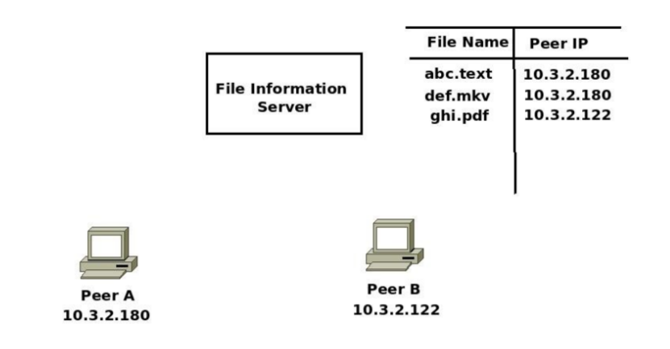

# fissNet

File Information Server made for NETworks Lab 2017


## Run your own fis

* Start IFS_Server -
```
  g++ FIS_Server.cpp -o fis
  ./fis port
```
 The port number must be between 10000 and 15000

* Start the server for file transfer
```
g++ Peer_Server.cpp -o server
./server fis_ip port
```

The server will automatically upload all the files in the current directory of Peer_Server.cpp

* Downloaded the shared files by running the client
```
g++ Peer_Client.cpp -o client
./client fis_ip port
```
To share files, server and client both must be run.
To download files, only client needs to run.

## Working

The problem statement in mentioned in [File_Information_Server.pdf](File_Information_Server.pdf)

First FIS (File information Server) must be run. It keeps the track of all the files currently being shared on the network.

Whenever a server is run, all the files in server folder are uploaded.

A client can request for the file list or download any file. The client internally communicates with FIS to get the file information via Datagram sockets. Once the client mentions the file it wants to share, it communicates with the corresponding server via steam sockets.

## Members :

- Surya Midatala [@kingofools](https://github.com/kingofools)

- Kaustubh Hiware [@kaustubhhiware](https://github.com/kaustubhhiware)

## TODO

Currently one server works efficiently. Running multiple servers is not very reliable.
